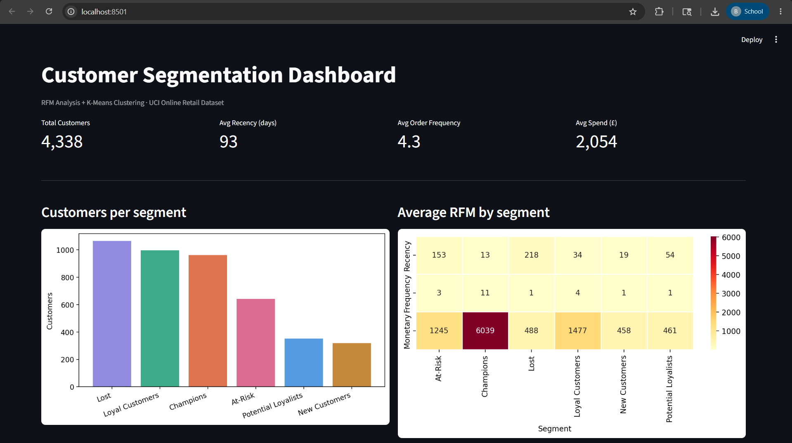
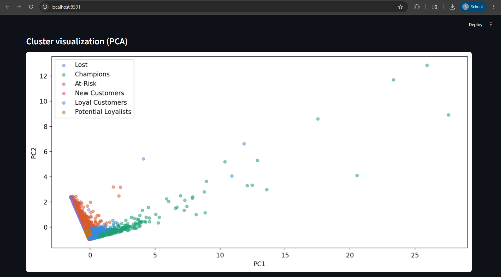

# Customer Segmentation using RFM Analysis + K-Means Clustering

## Problem
Businesses struggle to treat all customers the same way — a first-time buyer and a loyal high-spender need completely different marketing strategies. This project segments customers based on actual purchase behavior, so marketing teams can target each group with the right action.

## Key Findings
- Champions are only 22% of customers but drive **65.2% of total revenue (£5.8M out of £8.9M)**
- At-Risk customers represent £800K in revenue at risk of being lost — urgent win-back needed
- Lost customers (24.6% of base) account for only 5.8% of revenue — low re-engagement priority
- Monetary values are heavily skewed (one customer spent £280K) — Silhouette score favoured k=2, but rule-based RFM segmentation was used as the primary method for more meaningful business labels
- PCA explained 85.8% of variance in just 2 components

## Approach
**RFM Framework** — every customer is scored on three dimensions:
- **Recency** — how recently did they buy?
- **Frequency** — how often do they buy?
- **Monetary** — how much have they spent?

K-Means clustering groups customers into behavioral segments automatically, validated with the Silhouette score and Elbow method.

## Dashboard



## Dataset
[UCI Online Retail Dataset](https://archive.ics.uci.edu/dataset/352/online+retail) — 541,909 real transactions from a UK-based online retailer (2010–2011). After cleaning: 397,884 transactions across 4,338 unique customers.

## Segments Identified
| Segment | Customers | % Revenue | Recommended Action |
|---|---|---|---|
| Champions | 962 (22.2%) | 65.2% | Reward with loyalty perks, ask for referrals |
| Loyal Customers | 998 (23.0%) | 16.5% | Upsell premium products |
| New Customers | 319 (7.4%) | 1.6% | Strong onboarding sequence |
| Potential Loyalists | 351 (8.1%) | 1.8% | Nurture with targeted offers |
| At-Risk | 643 (14.8%) | 9.0% | Urgent win-back campaign |
| Lost | 1065 (24.6%) | 5.8% | Low priority re-engagement |

## Tech Stack
- `pandas` — data cleaning and RFM feature engineering
- `scikit-learn` — K-Means clustering, PCA, StandardScaler
- `matplotlib` / `seaborn` — EDA and segment visualizations
- `streamlit` — interactive dashboard

## Project Structure
```plaintext
rfm-customer-segmentation/
├── data/                    # Raw dataset (not committed)
├── src/
│   ├── rfm_analysis.py      # Data cleaning + RFM computation
│   ├── clustering.py        # K-Means + PCA visualization
│   └── visualizations.py    # EDA plots + segment charts
├── screenshots/             # Dashboard preview images
├── main.py                  # Run full pipeline
├── app.py                   # Streamlit dashboard
└── requirements.txt
```
## How to Run
```bash
# 1. Install dependencies
pip install -r requirements.txt

# 2. Download dataset → save as data/online_retail.xlsx
# https://archive.ics.uci.edu/dataset/352/online+retail

# 3. Run the full pipeline
python main.py

# 4. Launch the dashboard
streamlit run app.py
```
